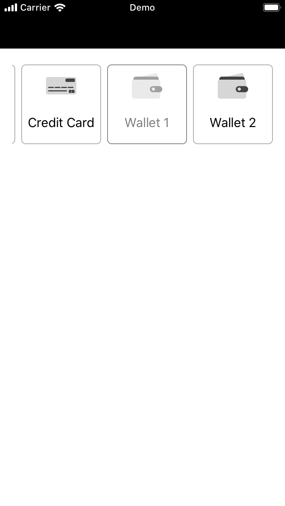

# CarouselButtons

> This library gives you a carousel of buttons to be used in your projects.

[![Swift Version][swift-image]][swift-url]
[![License][license-image]][license-url]

[![Build Status][bitrise-image]][bitrise-url]

This CarouselButtons library helps you to have a carousel of buttons.

<kbd> </kbd>

## Features

- [x] Add icon and title for your button.
- [x] Choose the initial state.
- [x] Add action when the buttton is selected.

## Requirements

- Xcode 12.x
- Swift 5.x

## Installation

#### CocoaPods

You can use [CocoaPods](http://cocoapods.org/) to install `CarouselButtons` by adding it to your `Podfile`:

```ruby
platform :ios, '15.0'
use_frameworks!
pod 'CarouselButtons', :git => 'https://github.com/TeloTechnology/CarouselButtons.git', :tag => '1.0.2'
```

#### Import after installation

To get the full benefits import `CarouselButtons`.

```swift
import CarouselButtons
```

#### Manually

1. Download and drop `CarouselButtons` folder in your project.
2. Congratulations!

## Usage example

1. Set the height to 126px via code or GUI.

2. Add the code below.

```swift

@IBOutlet
private weak var carouselCollectionButton: CarouselCollectionView!

let data = [
    (title: "Cash", icon: UIImage(named: "CashMoney"), isAvailable: true),
    (title: "Credit Card", icon: UIImage(named: "CreditCard"), isAvailable: true),
    (title: "Wallet 1", icon: UIImage(named: "Wallet"), isAvailable: false),
    (title: "Wallet 2", icon: UIImage(named: "Wallet"), isAvailable: true)
]

carouselCollectionButton.add(data)

carouselCollectionButton.didSelectButton = { position in
    print("Did select at: \(position) with title: \(data[position].title")
}
```

Check the demo project.

## Contribute

We would love you for the contribution to **CarouselButtons**, please create a Pull Request.

## Meta

Rudi Luis – [@Linkedin](http://linkedin.com/in/ruditluis)

Telo Technology Limited – [@Website](https://telotechnology.com)


[swift-image]: https://img.shields.io/badge/swift-5.0-red.svg
[swift-url]: https://swift.org/
[bitrise-image]: https://app.bitrise.io/app/f6cbac88d707c135/status.svg?token=FRIqXj0VP_wyUBLoxvk1NA&branch=master
[bitrise-url]: https://app.bitrise.io/app/f6cbac88d707c135
[license-image]: https://img.shields.io/badge/License-MIT-blue.svg
[license-url]: LICENSE
[cocoapods-image]: https://img.shields.io/badge/pod-1.8.3-blueviolet.svg
